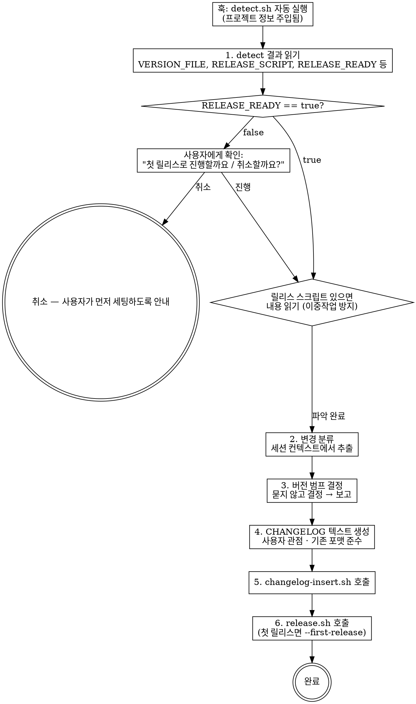

# Release Docs

LLM 세션 컨텍스트 기반 릴리스 자동화.

## 전제

플러그인 설치 시 `scripts/` 에 감지·범프·삽입·릴리스 스크립트가 포함된다. UserPromptSubmit 훅이 "릴리스" 키워드를 감지하면 `detect.sh`가 자동 실행되어 프로젝트 정보가 컨텍스트에 주입된다.

**스크립트 경로 결정:**
- Claude Code **글로벌 설치**: `${CLAUDE_PLUGIN_ROOT}/scripts/`
- **프로젝트 로컬 설치**(기본): `$CLAUDE_PROJECT_DIR/.release-docs/scripts/` (또는 사용자가 클론한 경로)
- Codex/Gemini: 클론한 경로(`.release-docs/scripts/` 등)

훅이 detect 결과를 주입했다면 이미 올바른 경로에서 실행된 것이므로 LLM은 동일한 경로를 재사용하면 된다.

## Workflow



## LLM이 하는 일 (스크립트에 없는 것)

### 1. detect 결과 읽기 + 릴리스 준비도 확인

훅이 주입한 detect 결과를 확인한다:
- `RELEASE_SCRIPT`가 있으면 **반드시 해당 파일을 읽고** 어떤 단계(빌드/커밋/태그/푸시/버전범프)를 포함하는지 파악. 이중 작업 방지용.
- `RELEASE_READY` 값에 따라 분기:
  - `true` → 바로 릴리스 워크플로우 진행
  - `false` → **자동 진행 금지.** 사용자에게 확인한 후에만 진행 (아래 1-a 참조)

#### 1-a. RELEASE_READY=false 처리 (예외: 이때는 사용자에게 묻는다)

`RELEASE_READY=false`는 버전 파일·릴리스 스크립트·이전 태그가 모두 없다는 뜻. 여기서 자동 릴리스하면 GitHub에 의도치 않은 빈 릴리스가 올라갈 수 있다. **평소의 "묻지 말고 결정" 원칙의 유일한 예외**.

사용자에게 다음과 같이 보고하고 선택을 받는다:

```
⚠️ 이 프로젝트는 아직 릴리스 인프라가 없습니다.
   - 버전 파일 없음
   - 릴리스 스크립트 없음
   - 이전 태그 없음

이대로 릴리스하면 GitHub에 빈 릴리스가 올라갈 수 있어 자동 진행을 멈췄습니다.
어떻게 할까요?

  1) 첫 릴리스로 진행 (v0.1.0 생성, VERSION + CHANGELOG 자동 세팅)
  2) 취소 — 먼저 릴리스 인프라(package.json/pyproject.toml 등)를 세팅할게요
```

- 사용자가 **1) 첫 릴리스** 선택 → 이후 단계 진행하고 `release.sh` 호출 시 `--first-release` 플래그 추가
- 사용자가 **2) 취소** 선택 → 현재 워크플로우를 중단하고, 어떤 버전 파일/릴리스 스크립트를 만들면 좋을지 간단히 제안만 한다 (사용자가 직접 세팅하도록)

### 2. 변경 분류

**세션 컨텍스트에서** 이번 세션에 수행한 작업을 분류:

| 카테고리 | 판별 기준 |
|---------|----------|
| Breaking | API 시그니처 변경, 기존 동작 제거 |
| 새 기능 | 없던 기능 추가 |
| 버그 수정 | 오작동 수정 |
| 개선 | 성능/UX 향상 (기능 변경 없음) |
| 내부 | 리팩터링 (사용자 영향 없음) |

### 3. 버전 범프 결정

**사용자에게 묻지 않는다.** 자동 결정:

| 최상위 변경 | 범프 |
|------------|------|
| Breaking | major (1.0 미만이면 minor) |
| 새 기능 | minor (1.0 미만이면 patch) |
| 버그 수정/개선만 | patch |

보고만 한다 (확인 요청 아닌 통보):
```
버전: 0.10.14 → 0.10.15 (patch — 버그 수정 + 개선)
```

### 4. CHANGELOG 텍스트 생성

기존 CHANGELOG가 있으면 **기존 포맷을 그대로** 따른다. 없으면 프로젝트 언어/문화권에 맞춰 작성.

작성 규칙:
- **사용자 관점만**. 함수명/파일명/내부 구현 노출 금지
- **세션 컨텍스트 기반**. 커밋 메시지가 아닌 실제 작업 기술
- 보안 수정은 구체적 취약점 노출하지 않음
- 빈 카테고리는 생략

### 5. 기능 문서 확인

`DOCS_DIR`이 감지되었고 새 기능이 있으면:
- 관련 문서 존재 여부 확인
- 필요시 업데이트 (사용자에게 묻지 않음)

## 스크립트 호출

`SCRIPTS_DIR`은 설치 방식에 따라 다르다:
- 글로벌 설치: `${CLAUDE_PLUGIN_ROOT}/scripts`
- 프로젝트 로컬 설치: `$CLAUDE_PROJECT_DIR/.release-docs/scripts` (또는 사용자 클론 경로)

```bash
# CHANGELOG 삽입 (파일이 없으면 자동 생성)
# CHANGELOG_PATH가 비어있으면 CHANGELOG.md로 기본값 사용
CHANGELOG_PATH="${CHANGELOG:-CHANGELOG.md}"
echo "$CHANGELOG_TEXT" | bash "$SCRIPTS_DIR/changelog-insert.sh" "$CHANGELOG_PATH"

# 릴리스 실행 (프로젝트 자체 스크립트가 있으면 자동 위임)
# RELEASE_READY=true 인 경우
bash "$SCRIPTS_DIR/release.sh" "$BUMP_TYPE" .

# RELEASE_READY=false 이고 사용자가 첫 릴리스 진행을 승인한 경우
bash "$SCRIPTS_DIR/release.sh" "$BUMP_TYPE" . --first-release
```

- `--first-release` 없이 `RELEASE_READY=false` 프로젝트에서 실행하면 스크립트는 `exit 2`로 **중단**한다 (의도된 동작)
- 릴리스 스크립트가 버전 범프를 포함하면 `bump-version.sh` 호출 불필요 — `release.sh`가 판단

**첫 릴리스(`--first-release`) 동작:**
- 버전 파일 없으면 `VERSION` 파일을 `0.1.0` (또는 `LATEST_TAG` 값)으로 생성
- CHANGELOG 없으면 `changelog-insert.sh`가 `CHANGELOG.md`를 생성
- git 원격 없으면 푸시 건너뛰고 로컬 커밋/태그만 생성 (원격에 빈 릴리스 안 올라감)

## Red Flags

- "버전을 몇으로 올릴까요?" → **묻지 말고 결정하라** (`RELEASE_READY=false`의 첫 릴리스 확인은 예외)
- "이 플랜대로 진행할까요?" → **확인 요청 금지. 보고 후 바로 실행**
- `RELEASE_READY=false`인데 `--first-release` 없이 릴리스 강행 → **빈 릴리스 사고. 반드시 사용자 확인 후 플래그 붙여서 호출**
- CHANGELOG에 함수명이 있다 → **사용자 관점으로 재작성**
- "커밋 메시지 기반으로 CHANGELOG 작성" → **세션 컨텍스트를 사용**
- detect 결과의 RELEASE_SCRIPT를 읽지 않았다 → **반드시 읽고 이중 작업 방지**
- DOCS_DIR이 있는데 확인 안 했다 → **기능 문서 확인 건너뛰지 마라**
