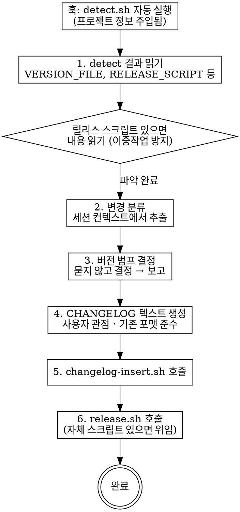

# Release Docs

LLM 세션 컨텍스트 기반 릴리스 자동화.

## 전제

플러그인 설치 시 `scripts/` 에 감지·범프·삽입·릴리스 스크립트가 포함된다. UserPromptSubmit 훅이 "릴리스" 키워드를 감지하면 `detect.sh`가 자동 실행되어 프로젝트 정보가 컨텍스트에 주입된다.

## Workflow



## LLM이 하는 일 (스크립트에 없는 것)

### 1. detect 결과 읽기

훅이 주입한 detect 결과를 확인한다:
- `RELEASE_SCRIPT`가 있으면 **반드시 해당 파일을 읽고** 어떤 단계(빌드/커밋/태그/푸시/버전범프)를 포함하는지 파악
- 이중 작업 방지를 위해 필수

### 2. 변경 분류

**세션 컨텍스트에서** 이번 세션에 수행한 작업을 분류:

| 카테고리 | 판별 기준 |
|---------|----------|
| Breaking | API 시그니처 변경, 기존 동작 제거 |
| 새 기능 | 없던 기능 추가 |
| 버그 수정 | 오작동 수정 |
| 개선 | 성능/UX 향상 (기능 변경 없음) |
| 내부 | 리팩터링 (사용자 영향 없음) |

### 3. 버전 범프 결정

**사용자에게 묻지 않는다.** 자동 결정:

| 최상위 변경 | 범프 |
|------------|------|
| Breaking | major (1.0 미만이면 minor) |
| 새 기능 | minor (1.0 미만이면 patch) |
| 버그 수정/개선만 | patch |

보고만 한다 (확인 요청 아닌 통보):
```
버전: 0.10.14 → 0.10.15 (patch — 버그 수정 + 개선)
```

### 4. CHANGELOG 텍스트 생성

기존 CHANGELOG가 있으면 **기존 포맷을 그대로** 따른다. 없으면 프로젝트 언어/문화권에 맞춰 작성.

작성 규칙:
- **사용자 관점만**. 함수명/파일명/내부 구현 노출 금지
- **세션 컨텍스트 기반**. 커밋 메시지가 아닌 실제 작업 기술
- 보안 수정은 구체적 취약점 노출하지 않음
- 빈 카테고리는 생략

### 5. 기능 문서 확인

`DOCS_DIR`이 감지되었고 새 기능이 있으면:
- 관련 문서 존재 여부 확인
- 필요시 업데이트 (사용자에게 묻지 않음)

## 스크립트 호출

```bash
# CHANGELOG 삽입 (생성한 텍스트를 stdin으로 전달)
echo "$CHANGELOG_TEXT" | bash "${CLAUDE_PLUGIN_ROOT}/scripts/changelog-insert.sh" "$CHANGELOG_PATH"

# 릴리스 실행 (프로젝트 자체 스크립트가 있으면 자동 위임)
bash "${CLAUDE_PLUGIN_ROOT}/scripts/release.sh" "$BUMP_TYPE" .
```

릴리스 스크립트가 버전 범프를 포함하면 `bump-version.sh` 호출 불필요 — `release.sh`가 판단.

## Red Flags

- "버전을 몇으로 올릴까요?" → **묻지 말고 결정하라**
- "이 플랜대로 진행할까요?" → **확인 요청 금지. 보고 후 바로 실행**
- CHANGELOG에 함수명이 있다 → **사용자 관점으로 재작성**
- "커밋 메시지 기반으로 CHANGELOG 작성" → **세션 컨텍스트를 사용**
- detect 결과의 RELEASE_SCRIPT를 읽지 않았다 → **반드시 읽고 이중 작업 방지**
- DOCS_DIR이 있는데 확인 안 했다 → **기능 문서 확인 건너뛰지 마라**
