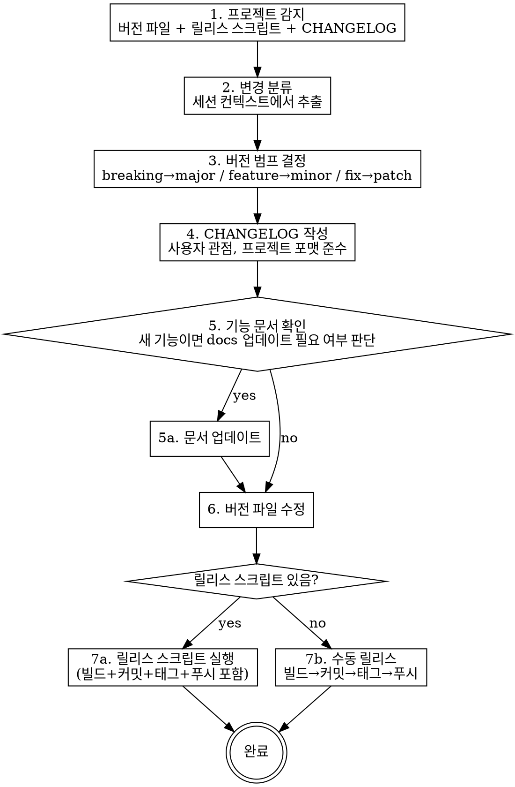

# Release Docs

LLM 세션 컨텍스트 기반 릴리스 자동화. 스크립트 없는 프로젝트에서도 동작한다.

## Workflow



## Step 1: 프로젝트 감지

아래 순서로 탐색한다. **사용자에게 묻지 않고 자동 감지한다.**

### 버전 파일

| 파일 | 에코시스템 | 버전 위치 |
|------|-----------|----------|
| `package.json` | Node.js | `"version": "x.y.z"` |
| `pyproject.toml` | Python | `version = "x.y.z"` |
| `Cargo.toml` | Rust | `version = "x.y.z"` |
| `build.gradle` / `build.gradle.kts` | JVM | `version = 'x.y.z'` |
| `VERSION` | 범용 | 파일 내용 자체가 버전 |

여러 개 있으면 모두 업데이트한다.

### 릴리스 스크립트

| 탐색 위치 | 예시 |
|----------|------|
| `package.json` scripts | `"release"`, `"release:patch"` 등 |
| `scripts/release.*` | `release.js`, `release.sh`, `release.py` |
| `Makefile` | `make release` 타겟 |
| `Justfile` | `just release` |

**스크립트를 찾으면 반드시 내용을 읽고** 어떤 단계를 수행하는지 파악한다:
- 빌드 포함 여부
- 커밋 포함 여부 (이중 커밋 방지)
- 태그 포함 여부
- 푸시 포함 여부

### CHANGELOG

| 탐색 경로 (우선순위순) |
|----------------------|
| `CHANGELOG.md` (루트) |
| `docs/CHANGELOG.md` |
| `CHANGES.md` |
| `HISTORY.md` |

없으면 **루트에 `CHANGELOG.md` 생성**한다.

### 기능 문서 디렉터리

`docs/guide/`, `docs/`, `wiki/` 등 존재 여부 확인. 있으면 Step 5에서 활용.

## Step 2: 변경 분류

**세션 컨텍스트에서** 이번 세션에 수행한 작업을 추출하고 분류한다.

| 카테고리 | 판별 기준 |
|---------|----------|
| **Breaking** | API 시그니처 변경, 기존 동작 제거, 호환성 깨짐 |
| **새 기능** | 없던 기능 추가, 새 UI 요소, 새 명령어 |
| **버그 수정** | 기존 기능의 오작동 수정 |
| **개선** | 성능, UX, 코드 품질 향상 (기능 변경 없음) |
| **내부** | 리팩터링, 의존성 업데이트 (사용자 영향 없음) |

## Step 3: 버전 범프 결정

**사용자에게 묻지 않는다.** 변경 분류에서 자동 결정:

| 최상위 변경 | 범프 |
|------------|------|
| Breaking 있음 | **major** (1.0 미만이면 minor) |
| 새 기능 있음 | **minor** (1.0 미만이면 patch) |
| 버그 수정/개선만 | **patch** |

결정한 버전을 사용자에게 **보고**한다 (확인 요청이 아닌 통보):
```
버전: 0.10.14 → 0.10.15 (patch — 버그 수정 + 개선)
```

## Step 4: CHANGELOG 작성

### 기존 CHANGELOG가 있을 때

**기존 포맷을 그대로 따른다.** 헤더 스타일, 카테고리명, 들여쓰기를 기존 항목과 일치시킨다.

### 새로 생성할 때

프로젝트의 주 언어/문화권에 맞춰 작성한다. 한국어 프로젝트면 한국어, 영어 프로젝트면 영어.

```markdown
# Changelog

## vX.Y.Z (YYYY-MM-DD)

### 새 기능
- **기능명**: 사용자 관점 설명

### 버그 수정
- **버그명**: 무엇이 고쳐졌는지

### 개선
- **개선명**: 무엇이 나아졌는지

---
```

### 작성 규칙

- **사용자 관점으로만** 작성한다. 함수명, 파일명, 내부 구현 노출 금지.
- **세션 컨텍스트 기반**: 커밋 메시지가 아닌, 이 세션에서 실제로 한 작업을 기술한다.
- 보안 관련 수정은 구체적 취약점을 노출하지 않는다.
- 항목이 없는 카테고리는 생략한다.

## Step 5: 기능 문서 확인

새 기능이 있고, 기능 문서 디렉터리가 존재하면:
1. 관련 문서가 이미 있는지 확인
2. 없거나 업데이트 필요하면 작성/수정
3. 문서 불필요하면 건너뛴다 (사용자에게 묻지 않음)

## Step 6: 버전 범프

**릴리스 스크립트가 버전 범프를 포함하면 이 단계를 건너뛴다.** 스크립트가 없거나, 스크립트가 버전 범프를 하지 않을 때만 직접 수정한다.

감지된 **모든** 버전 파일을 업데이트한다.

## Step 7: 릴리스 실행

**실행한다. 확인을 요청하지 않는다.** "이 플랜대로 진행할까요?" 같은 질문 금지. 보고 후 바로 실행.

### 7a. 릴리스 스크립트가 있을 때

Step 1에서 파악한 스크립트의 동작에 따라 **중복되는 단계를 모두 생략**:

| 스크립트가 하는 일 | 이 스킬이 할 일 |
|------------------|---------------|
| 버전 범프 포함 | **Step 6 건너뜀** |
| 빌드 포함 | 빌드 생략 |
| 커밋 포함 | **커밋하지 않음** (이중 커밋 방지) |
| 태그 포함 | 태그 생략 |
| 푸시 포함 | 푸시 생략 |

스크립트에 버전 범프 인자가 필요하면 전달한다:
```bash
# 예시
node scripts/release.js patch
npm run release -- patch
make release VERSION=0.3.3
```

### 7b. 릴리스 스크립트가 없을 때

순서대로 실행:

1. **빌드** — `package.json`에 `build` 스크립트가 있으면 `npm run build`, 없으면 생략
2. **스테이징** — 변경된 파일을 명시적으로 `git add` (버전 파일 + CHANGELOG + 문서)
3. **커밋** — `chore: release vX.Y.Z`
4. **태그** — `git tag vX.Y.Z`
5. **푸시** — `git push && git push --tags`

## 이중 커밋 방지

**가장 흔한 실수.** 릴리스 스크립트가 커밋을 포함하는데 스킬이 또 커밋하면 빈 커밋이 생기거나 에러가 난다.

Step 1에서 스크립트를 읽고 어떤 git 명령을 실행하는지 반드시 확인한다. 스크립트가 `git commit`을 포함하면:
- CHANGELOG와 문서만 수정하고 **커밋하지 않는다**
- 스크립트가 `git add -u` 등으로 변경사항을 잡아주므로 스테이징도 불필요할 수 있다

## Red Flags — 이 스킬을 위반하고 있다는 신호

- "버전을 몇으로 올릴까요?" → **묻지 말고 결정하라**
- "이 플랜대로 진행할까요?" → **확인 요청 금지. 보고 후 바로 실행하라**
- "릴리스 스크립트가 뭘 하는지 모르겠으니 일단 커밋하겠습니다" → **반드시 읽고 확인하라**
- 릴리스 스크립트가 버전 범프하는데 직접도 수정했다 → **이중 범프. Step 1에서 파악한 동작을 재확인하라**
- CHANGELOG에 `updateDOMPosition()` 같은 함수명이 있다 → **사용자 관점으로 재작성하라**
- "커밋 메시지를 기반으로 CHANGELOG를 작성하겠습니다" → **세션 컨텍스트를 사용하라**
- 가이드 문서 디렉터리가 있는데 확인도 안 했다 → **Step 5를 건너뛰지 마라**
